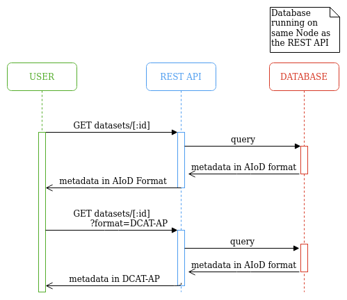

# AIoD API 

This repository contains the AI on Demand (AIoD) REST API. It is built with 
[FastAPI](https://fastapi.tiangolo.com/)
that interacts with a database ([MySQL](https://hub.docker.com/_/mysql))
and [OpenML's REST API](https://www.openml.org/apis).
Both the database and the REST API are run from docker in separate containers.

The AIoD REST API will allow any kind of service to interact with the AIoD portal to discover, 
retrieve, and share AI resources. It forms the connection between user-facing components, such 
as the AIoD website or Python Client API, and the backend. The metadata for datasets, models 
and other resources can be accessed, added, updated and deleted through this API. 

## Architecture
All metadata is stored in the AIoD metadata database. For every instance of the API (there will 
be multiple running instances, for reliability and performance), an instance of this database 
will run on the same machine (on the same node). The type of database is not yet determined, for 
now we use a simple MySQL database.

The metadata is stored in AIoD format. When the user requests an item, such as a dataset, it can 
be returned in AIoD format, or converted to any supported format, as requested by the user. For 
datasets, we will for instance support schema.org and DCAT-AP.

Requesting a dataset will therefore be simply:



To fill the database, a synchronization process must be running continuously for every platform 
(e.g. HuggingFace or OpenML). This synchronization service of a platform will be deployed at a 
single node. The synchronization service queries its platform for updates, converts the metadata 
to the AIoD format and updates the database.

Note that this synchronization process between the platform and the database, is different from 
the synchronization between database instances. The latter is under discussion in the AIoD 
Synchronization Meetings. 

## Installation

This repository contains two systems; the database and the REST API.
As a database we use a containerized MySQL server (through Docker), the REST API can be run locally or containerized.
Information on how to install Docker is found in [their documentation](https://docs.docker.com/desktop/).

### Starting a MySQL Server

We use the default [MySQL Docker image](https://hub.docker.com/_/mysql).
By default, the database is stored within the docker container and will thus be deleted when the container is removed.
Instructions on using a persistent storage can be found at the end of this section.

First, we define a docker network to allow our server to be reachable from other docker containers:

```bash
docker network create sql-network
```

Then, start the MySQL Server:

```bash
docker run -e MYSQL_ROOT_PASSWORD=ok --name sqlserver --network sql-network -d mysql
```

That's all! You should be able to connect to the server now, though no database is present yet:

```bash
docker run -it --network sql-network --rm mysql mysql -hsqlserver -uroot -pok
```

```bash
mysql> SHOW DATABASES;
+--------------------+
| Database           |
+--------------------+
| information_schema |
| mysql              |
| performance_schema |
| sys                |
+--------------------+
4 rows in set (0.03 sec)
```

#### Persistent Storage

The data is persistent when simply stopping and restarting the server:

```bash
docker stop sqlserver
docker start sqlserver
```

However, all data is lost when the container is deleted.
To ensure data can persist even if the container is deleted, allow the Docker container to write to a directory on the
host machine.
To do that, mount a volume by adding `-v /ABSOLUTE/PATH/TO/HOST/DIR:/var/lib/mysql` to the docker command that starts
the server
(it's also possible to create a docker
volume ([docs](https://docs.docker.com/engine/reference/commandline/run/#mount-volume--v---read-only))).
If you want to use a path within this repository directory, we recommend naming the directory `data` since then it will
automatically be ignored by git.
For more information, see "Where to Store Data" in the linked documentation.

### Starting the REST API

The repository provides a Dockerfile to run the REST API in a containerized environment.

#### Using the Docker container

First, build the docker image from the dockerfile:

```bash
docker build --tag ai4eu_server_demo:latest -f Dockerfile .
```

then create a container from that image, remember to forward the port and connect to the right docker network.

```bash
docker run --network sql-network -it -p 8000:8000 --name apiserver ai4eu_server_demo
```

At this point you should be able to visit the server from your browser at `localhost:8000/docs`.

#### Local Installation

If you want to run the server locally, you need Python 3.11.
We advise creating a virtual environment first and install the dependencies there:

```bash
python3 -m venv venv
source venv/bin/activate
python -m pip install .
```

Note that the `mysqlclient` dependency requires additional tooling before it can be installed.
In case this tooling is not already available, please have a look
at [their installation instructions](https://github.com/PyMySQL/mysqlclient#install).

For development, you will need to install the optional dependencies as well:

```bash
source venv/bin/activate
python -m pip install ".[dev]"
```

Moreover, you are encouraged to install the pre-commit hooks, so that black, mypy and the unittests
run before every commit:
```bash
pre-commit install
```
Alternatively, you can run 
```bash
precommit run --all-files
```
To run pre-commit manually.

After installing the dependencies you can start the server:

```bash
cd src
python main.py --reload
```

The `--reload` argument will automatically restart the app if changes are made to the source files.


#### Devcontainer Installation

If you want to run the server on and isolated container pre configured for the proyect you can open the proyect via docker dashboard. On the dev container section click `create a new enviroment`


Follow the instructions and select the root folder of the project:


 
 After it docker will ask you for selection de devcontainer and open it on vscode, you should choose aiod-app-1:
 
 


### Populating the Database

By default, the app will connect to the database and populate it with a few items if there is no data present.
You can change this behavior through parameters of the script:

* **rebuild-db**: "no", "only-if-empty", "always". Default is "data".
    * no: connect to the database but don't make any modifications on startup.
    * only-if-empty: if the database does not exist, create it. Then, if the tables do not exist, create them.
      Then, if the tables are empty, populate according to `populate`.
    * always: drop the configured database and rebuild its structure from scratch.
      Effectively a `DROP DATABASE` followed by a `CREATE DATABASE` and the creation of the tables.
      The database is then repopulated according to `populate`.
      **Important:** data in the database is not restored. All data will be lost. Do not use this option
      if you are not sure it is what you need.

* **populate**: one of "nothing", "example", or "openml". Default is "example".
  Specifies what data to add the database, only used if `rebuild-db` is "only-if-empty" or "always".
    * nothing: don't add any data.
    * example: registers two datasets and two publications.
    * openml: registers all datasets on OpenML, this may take a while (~30 minutes).

## Usage

Following the installation instructions above, the server may be reached at `127.0.0.1:8000`.
REST API documentation is automatically built and can be viewed at `127.0.0.1:8000/docs`.

#### Editing Files Locally

While developing the server it is often convenient to edit the files on the host machine.
To avoid rebuilding the docker container each time you edit the files, you can mount the host files into the container.
Mount your repository's `src` directory into the container's `/app` directory by adding `-v $(pwd)/src:/app`.

#### Automatically Restart on Change

If you want to automatically restart the server when a change is made to a file in the project, use the `--reload`
parameter.
It is important to realize that this also re-initializes the connection to the database, and possibly will do any
start-up work (e.g., populating the database).

#### Database Structure

The Python classes that define the database tables are found in [src/database/model/](src/database/model/). 
The structure is based on the 
[metadata schema](https://docs.google.com/spreadsheets/d/1n2DdSmzyljvTFzQzTLMAmuo3IVNx8yposdPLItBta68/edit?usp=sharing).


## Releases

### Breaking changes
Breaking changes of a resource include deleting a field, changing the name of an existing field, 
or changing the datatype of a field. Adding new fields is not a breaking change.

On a breaking change for a resource (e.g. for Dataset), a new router with a new version should 
be created. The existing router should be deprecated, and rewritten so that it can handle the 
new metadata of the database. This deprecation of a router will be visible in the Swagger 
documentation. Calls to a deprecated router will still work, but a response header "Deprecated" 
will be added with the deprecation date. The deprecated router will then be deleted on the next 
release.

On non-breaking changes of a resource, a new version is not needed for the corresponding router.

Example:
- Start www.aiod.eu/api/datasets/v0
- Release 1: www.aiod.eu/api/datasets/v0 (no breaking changes)
- Release 2:
  - www.aiod.eu/api/datasets/v0 (deprecated)
  - www.aiod.eu/api/datasets/v1
- Release 3: www.aiod.eu/api/datasets/v1

### Database migration

The database should always be up-to-date with the latest version of the metadata. As database 
migration tool, [Alembic](https://alembic.sqlalchemy.org/en/latest/) is the default choice for
SQLAlchemy. The setup of this db migration for AIOD remains a TODO for now. 

### Changelog

As changelog we use the Github tags. For each release, a release branch should be created with a 
bumped version in the pyproject.toml, and merged with the master. The tag should contain a 
message detailing all the breaking and non-breaking changes. This message should adhere to the 
guiding principles as described in https://keepachangelog.com/. 

To get an overview of the complete changelog, the Github API can be used:
 - Get all tags: https://api.github.com/repos/aiondemand/AIOD-rest-api/git/refs/tags
 - Get all information for a single tag: https://api.github.com/repos/aiondemand/AIOD-rest-api/git/tags/080e9afa5a1fe84316d4e39d8bc669a1fce9f24d