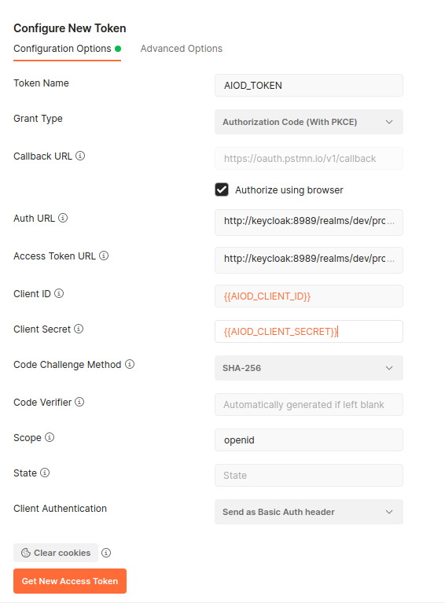

# AIoD + Authentication (Keycloak) demo

## Build and run the API, SQL and Keycloak

See the main [README.md](../README.md)


## Usage
First, run the Mysql server and the API.

Now you can use Swagger (easiest) or Postman (convenient for development).


### GET request using Swagger
- Go to http://localhost:8000/docs in your favourite browser
- Go to `/authorization_test`, click on `try it out` and `execute`. You should get an `Error: Unauthorized`
- Log in 
    - using `Authorize` button in the top right
    - Use `OpenIdConnect (OAuth2, authorization_code with PKCE)`
    - click `Authorize`
    - Use Google (if you don't have Google, you have to create a user in Keycloak. Ask Jos for the credentials.)
- Go to `/authorization_test`, click on `try it out` and `execute`. You should get a response such as:

```json
{
    "msg": "success",
    "user": {
        "sub": "[uuid]",
        "email_verified": true,
        "name": "[Your name]",
        "preferred_username": "[Your username]",
        "given_name": "[First name]",
        "family_name": "[Last name]",
        "email": "[Email]"
    }
}
```


### GET request using Postman:
If you edit a collection, you can use OAuth 2.0 authorization. See image:



- As `auth url`, use https://test.openml.org/aiod-auth/realms/dev/protocol/openid-connect/auth
- As `Access token url`, use https://test.openml.org/aiod-auth/realms/dev/protocol/openid-connect/token
- As `client id`, use `aiod-api`
- As `client secret`, use `7qpbFTGpONBPIn9nBovgd2843BK8Khjg`

Then, you should be able to send a `GET` to `localhost:8000/authorization_test`, expecting a 
response like:

```json
{
    "msg": "success",
    "user": {
        "sub": "[uuid]",
        "email_verified": true,
        "name": "[Your name]",
        "preferred_username": "[Your username]",
        "given_name": "[First name]",
        "family_name": "[Last name]",
        "email": "[Email]"
    }
}
```

## Running keycloak locally

Running locally is possible, but is not recommended. It's easier to have a Keycloak server, even for testing, so that the hostname is the same (keycloak and the identity providers are quite picky about that).


The problem is that the dockerized API thinks that the keycloak is located at host 
`keycloak` (the name of the keycloak docker), while our keycloak console thinks that it's hosted at `localhost`. This is a problem for the authentication. The url of the keycloak is embedded in the token (the `iss` field), and must be the same as the url that the API uses, otherwise the API cannot authenticate the user. But... when accessing the Google Identity Provider, Google requires the redirect-url to be localhost.

Therefore, let's just use the Keycloak server at test.openml.org/aiod-auth. This server is setup by Jos.

